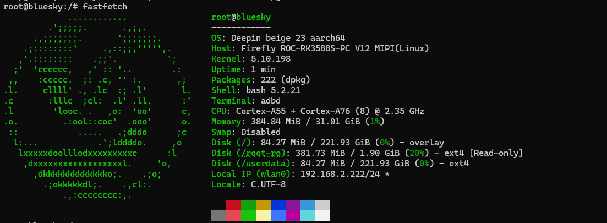
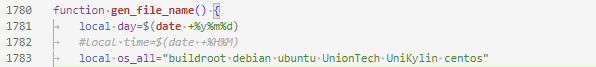

# 前情

近日（上周五），社区内核研发说之前采购了个 ROC-RK3588S-PC 的板子，闲置着但一直没有适配系统，deepin v23 上了 arm 架构支持，那我们也可以在 arm 设备上运行 deepin 系统了。本着板板不能浪费的原则，开始了适配工作。

# 介绍

**ROC-RK3588S-PC** 基于 Rockchip 全新一代旗舰 AIoT 芯片 –  **RK3588** ，采用了 8nm LP 制程；搭载八核（Cortex-A76 x 4 + Cortex-A55 x 4）64位 CPU，主频高达2.4 GHz。采购的这个设备是 32GB 运行内存，256 GB 的存储。

# 制作根文件系统

在查看官方的文档后，了解到该开发板安装系统是通过刷写固件到 eMMC 的方式，官方发布的固件是采用统一固件格式，由分区表、bootloader、uboot、kernel、system等所有文件打包合并成的单个文件。原本想解开 img 文件查看里面存放了哪些数据，结果用 loop 挂载 img 文件发现是不识别的文件系统，看来不是简单的区的文件系统。于是提问官方，收到答复 [导出设备系统](https://wiki.t-firefly.com/zh_CN/ROC-RK3588S-PC/linux_ubuntu_manual.html#dao-chu-she-bei-xi-tong) ，用户从已有设备上的工作环境将根文件系统重新导出，问题在于先有鸡还是先有蛋的问题，我们现在没有鸡，没法生出蛋。看来官方也没提供给用户制作其他发行版根文件系统的方法。那我们自己动手丰衣足食。与是先安装了一下官方提供的 Ubuntu 系统，然后导出根文件系统后，我们获得到了一个 img 文件。

通过 file 命令查看后，是 ext4 文件系统。

```
╰─❯ file ubuntu-rootfs.img                                                                                                                                                                         
ubuntu-rootfs.img: Linux rev 1.0 ext4 filesystem data, UUID=830ad934-e0a2-41da-bfb6-2a61fdc26939, volume name "rootfs" (needs journal recovery) (extents) (64bit) (large files) (huge files)
```

通过 losetup 命令将 img 文件挂载上，我们查看下分区以及文件系统存放了什么。

```bash
sudo losetup -Pf ubuntu-rootfs.img
```

```bash
╰─❯ lsblk                                                                                                                                                                                            
NAME        MAJ:MIN RM   SIZE RO TYPE MOUNTPOINTS
loop0         7:0    0   2.5G  0 loop /media/sda/code/rk3588_sdk/ubuntu_rootfs/root
```

通过 lsblk 命令，我们看到该文件系统只分了一个分区。再进入到里面，boot 下面没有存放任何文件，那我们基本思路就有了，不需要在根文件安装内核、u-boot。只将系统运行使用的一般软件包打包，再放入 ext4 文件系统里生成  img 文件（后面提供打包脚本）。

# 构建固件

官方提供通过 SDK 生成固件，给了几个不同发行版打包固件的方法。我们查看到 [编译 Ubuntu 固件](https://wiki.t-firefly.com/zh_CN/ROC-RK3588S-PC/linux_compile.html#bian-yi-ubuntu-gu-jian) 前面拉取 SDK 的部分不做赘述，参照官方文档给出的示例。在查看官方给的示例，结合 SDK 中的 Makefile 文件，可以得到结论可以复用 Ubuntu 的构建。

在 SDK 中选择配置文件

```bash
./build.sh roc-rk3588s-pc-ubuntu.mk 
```

```bash
mkdir ubuntu_rootfs
```

在 SDK 项目目录下新建 ubuntu_rootfs 目录，并将 deepin 的根文件系统的 img 修改为 rootfs.img。

SDK 构建需要依赖 Python2 现在到 deepin v23 以及一些发行版早已停止了 Python2 的维护，按照教程的推荐，我们创建了一个 Ubuntu18.04 的 Docker 容器，在容器中构建固件。

安装构建环境

```bash
sudo apt-get install repo git ssh make gcc libssl-dev liblz4-tool \
expect g++ patchelf chrpath gawk texinfo chrpath diffstat binfmt-support \
qemu-user-static live-build bison flex fakeroot cmake gcc-multilib g++-multilib \
unzip device-tree-compiler ncurses-dev
```

```bash
./build.sh
```

开始构建，等待构建结束后。

在项目下的 rockdev/pack 会有个 img 文件，我们将这个 img 文件拷贝到 Windows 或者 deepin 上，参考官方 [使用USB线缆升级固件](https://wiki.t-firefly.com/zh_CN/ROC-RK3588S-PC/upgrade_firmware.html) 的内容，这里我使用 Windows 和 deepin v23 都可以正常使用工具烧录。

在上电完开机后，通过 `adb shell` 命令可以进入开发板。

系统成功运行，网络连接等也正常。看着步骤挺少的，是不是感觉挺简单的，中间过程倒是挺费时间的。

# 运行脚本

在 [deepin-firefly-img](https://github.com/chenchongbiao/deepin-firefly-img) 项目中，运行 `./build.sh` 会在通目录下生成 `deepin-rootfs.img` 文件。

# 后续

现在只是单纯的运行起 cli ，后续需要安装桌面环境，不过貌似官方 SDK 构建的固件，默认是支持 mipi 屏的，HDMI 需要通过修改设备树重新编译，待后续研究明白附上内容。官方系统的固件只需要发行版提供根文件系统的话，那其他型号的开发板理论上可以复用相同根文件系统，烧录不同的固件。

# 小插曲

## adbd 服务

一开始还疑惑刷入官方固件后，启动系统就可以直接使用 adb 调试，在通过 pstree 查看系统服务，发现有个 adbd 的进程，通过 dpkg 查看后发现不是源里自带的，应该是官方自己另外提供的。与是找到 adbd 服务定义的文件，对应拷贝到 deepin 的根文件系统中，启动系统后成功用 `adb shell` 进入系统。

## 串口调试

该开发板上串口通信的槽是三针脚的接口，如果使用杜邦线无法插入，引脚的间距也过小，于是把中间杜邦线线帽取下，以为这样可以正常调试了，上电后发现，能在串口工具看到输出，但是输入都没有响应（也可能是我操作问题）。

## UOS 支持？

在查看 SDK 代码的时候，发现了一段发行版定义的部分。这里定义了 UnionTch，不过没看到 UOS 的固件，也可能是非公开项目。



# 参考

[ROC-RK3588S-PC Manual](https://wiki.t-firefly.com/zh_CN/ROC-RK3588S-PC/index.html)

# 项目

[deepin-firefly-img](https://github.com/chenchongbiao/deepin-firefly-img)
